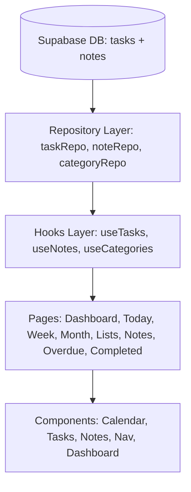

# Sanal Ajandam V2 — Kapsamlı Geliştirme & Dönüşüm Planı

Bu plan; kullanıcı notları, 2026 yılı modern ajanda standartları, mimari gereksinimler, veritabanı şeması ve arayüz iyileştirmelerini eksiksiz şekilde kapsayan resmi uygulama rehberidir.

---

## 1. Kullanıcı Onayına Sunulan Temel Kararlar & Mimari Özet

> [!IMPORTANT]
> **Planın Kapsamı:** Bu geliştirme ile ajanda sadece mevcut hatalarından arınmakla kalmayacak; **Notlar (Kişisel Karalama Alanı)**, **Süresiz Planlar Havuzu**, **Çoklu Güne Görev Dağıtımı**, **Sürükle-Bırak**, **Düzeltilmiş Gecikme & Geri Sayım Mantığı** ve **Toplu Görev Girişi** ile tam donanımlı bir kişisel üretkenlik merkezine dönüşecektir.

### Mimari Kararlar:
1. **Veritabanı (`supabase/schema.sql`):**
   - `public.tasks`: `start_date` alanı `NULL` olabilir (Süresiz / Tarihsiz planlar için).
   - `public.notes` (YENİ TABLO): `id, user_id, title, content, color, is_pinned, tags, created_at, updated_at` alanları ile RLS güvenlik politikaları eklenecek.
2. **Gecikme Mantığı (Overdue):**
   - Görev saati geçse bile o gün içinde (saat 23:59'a kadar) görev **asla gecikmiş sayılmayacak**. Yalnızca gün değişip ertesi güne geçildiğinde ve hala tamamlanmadıysa gecikmiş (Sessiz Çığlıklar) havuzuna dahil edilecek.
3. **Çoklu Güne Görev Yayma:**
   - Görev oluştururken "Tarih Aralığı" veya "Seçilen Günler" (örn: Pzt, Sal, Çar) belirlendiğinde; aralık boyunca her gün için **bağımsız ayrı görev satırları** üretilecek. Böylece Pazartesi tamamlandığında Salı ve Çarşamba görevleri takvimde kalmaya devam edecek.
4. **Sürükle & Bırak (Drag & Drop):**
   - HTML5 Native Drag & Drop API kullanılarak sıfır ek paket bağımlılığı ile Haftalık, Günlük ve Süresiz Planlar arasında akıcı taşıma sağlanacak.

---

## 2. Değişiklik Yapılacak ve Eklenecek Dosyalar

### A. Veritabanı & Domain Katmanı
- [MODIFY] [supabase/schema.sql](file:///c:/Users/Baris/Desktop/yazılım/web_ajanda/supabase/schema.sql): `tasks.start_date` nullable yapılması, `public.notes` tablosu, indeksleri ve RLS politikalarının eklenmesi.
- [MODIFY] [src/domain/types.ts](file:///c:/Users/Baris/Desktop/yazılım/web_ajanda/src/domain/types.ts): `startDate` opsiyonel yapılması, `Note` arayüzünün ve etiket tiplerinin eklenmesi.
- [MODIFY] [src/domain/dateUtils.ts](file:///c:/Users/Baris/Desktop/yazılım/web_ajanda/src/domain/dateUtils.ts): `isOverdue` fonksiyonunun gün sonu esasına göre güncellenmesi (`startOfDay(taskEndDate) < startOfDay(now)`).
- [MODIFY] [src/domain/dateUtils.test.ts](file:///c:/Users/Baris/Desktop/yazılım/web_ajanda/src/domain/dateUtils.test.ts): Güncellenen gecikme mantığı birim testlerinin uyarlanması ve yeni test senaryolarının eklenmesi.

### B. Veri & Hook Katmanı
- [NEW] [src/data/noteRepository.ts](file:///c:/Users/Baris/Desktop/yazılım/web_ajanda/src/data/noteRepository.ts): Notlar için CRUD, pinleme ve arama Supabase işlemleri.
- [NEW] [src/hooks/useNotes.ts](file:///c:/Users/Baris/Desktop/yazılım/web_ajanda/src/hooks/useNotes.ts): Not yönetimi, iyimser durum güncellemeleri (optimistic updates) ve arama kancası.
- [MODIFY] [src/data/taskRepository.ts](file:///c:/Users/Baris/Desktop/yazılım/web_ajanda/src/data/taskRepository.ts): Nullable `start_date` desteği, toplu görev oluşturma (`createTasksBatch`).
- [MODIFY] [src/hooks/useTasks.ts](file:///c:/Users/Baris/Desktop/yazılım/web_ajanda/src/hooks/useTasks.ts): Süresiz görev filtreleme ve çoklu görev oluşturma desteği.

### C. Sayfa ve Navigasyon Katmanı
- [NEW] [src/pages/NotesPage.tsx](file:///c:/Users/Baris/Desktop/yazılım/web_ajanda/src/pages/NotesPage.tsx): Karalama defteri, renkli kartlar, arama, pinleme ve "Göreve Dönüştür" özellikli Notlar sayfası.
- [MODIFY] [src/routes.tsx](file:///c:/Users/Baris/Desktop/yazılım/web_ajanda/src/routes.tsx): `/notes` rotasının eklenmesi.
- [MODIFY] [src/components/nav/Sidebar.tsx](file:///c:/Users/Baris/Desktop/yazılım/web_ajanda/src/components/nav/Sidebar.tsx): "Notlar" menü öğesinin eklenmesi.
- [MODIFY] [src/pages/WeekPage.tsx](file:///c:/Users/Baris/Desktop/yazılım/web_ajanda/src/pages/WeekPage.tsx): Güne tıklandığında anasayfa yerine `/today` sayfasına yönlendirme düzeltmesi.
- [MODIFY] [src/pages/MonthPage.tsx](file:///c:/Users/Baris/Desktop/yazılım/web_ajanda/src/pages/MonthPage.tsx): "Güne Git" butonunun `/today` sayfasına yönlendirme kontrolü.
- [MODIFY] [src/pages/ListsPage.tsx](file:///c:/Users/Baris/Desktop/yazılım/web_ajanda/src/pages/ListsPage.tsx): "Süresiz Planlar / Havuz" sekmesinin eklenmesi ve tarihsiz görevlerin burada yönetilmesi.
- [MODIFY] [src/pages/DashboardPage.tsx](file:///c:/Users/Baris/Desktop/yazılım/web_ajanda/src/pages/DashboardPage.tsx): Bugün tamamlanan gecikmiş görevlerin (+2, +3 telafi edildi) hesaplanması ve kartlara aktarılması.

### D. Görev Bileşenleri & Arayüz İyileştirmeleri
- [MODIFY] [src/components/tasks/TaskFormModal.tsx](file:///c:/Users/Baris/Desktop/yazılım/web_ajanda/src/components/tasks/TaskFormModal.tsx): 
  - Tarih tipi seçimi: *Tek Gün*, *Süresiz Plan*, *Tarih Aralığı (Günlük Ayrı)*, *Özel Günler*.
  - *"Kaydet ve Yeni Ekle"* butonu ile seri görev girişi.
  - *"Toplu Satır Ekle"* (Multi-line quick add) modu.
- [MODIFY] [src/components/calendar/WeekCalendar.tsx](file:///c:/Users/Baris/Desktop/yazılım/web_ajanda/src/components/calendar/WeekCalendar.tsx): 
  - Mobilde yüksek öncelikli görevlerde kırmızı ünlemin başlığı dışarı taşırmasını engelleyen flex & line-clamp düzenlemesi.
  - Günler arası görev sürükle-bırak (Drag & Drop) desteği.
- [MODIFY] [src/components/dashboard/UpcomingTasks.tsx](file:///c:/Users/Baris/Desktop/yazılım/web_ajanda/src/components/dashboard/UpcomingTasks.tsx): Geri sayımın bitiş saatine değil başlangıç saatine (`startTime`) göre yapılması.
- [MODIFY] [src/components/dashboard/DailySummaryCard.tsx](file:///c:/Users/Baris/Desktop/yazılım/web_ajanda/src/components/dashboard/DailySummaryCard.tsx): Uzun ve tekrarlı metin yerine modern Sci-Fi HUD tarzı mini rozetler ve kısa öz durum cümlesi.
- [MODIFY] [src/components/dashboard/HeroCard.tsx](file:///c:/Users/Baris/Desktop/yazılım/web_ajanda/src/components/dashboard/HeroCard.tsx): Tamamlanan gecikmiş görevlerin `(+X Telafi Edildi)` yeşil rozetle gösterimi ve mobilde daralma/sıkışma düzeltmesi.

---

## 3. Adım Adım Uygulama Sırası

### Adım 1: Temel Mantık ve Bug Düzeltmeleri
1. `dateUtils.ts` içindeki `isOverdue` fonksiyonunu gün sonu esasına göre güncelleme.
2. `dateUtils.test.ts` testlerini çalıştırıp doğrulama.
3. `WeekPage.tsx` ve `MonthPage.tsx` navigasyon hedeflerini `/today` olarak düzeltme.
4. `UpcomingTasks.tsx` geri sayımını `startTime` esasına çevirme.
5. `WeekCalendar.tsx` mobildeki taşma sorununu giderme.

### Adım 2: Veritabanı & Domain Güncellemeleri
1. `supabase/schema.sql` dosyasında `tasks.start_date` nullable yapılması ve `notes` tablosu SQL'inin eklenmesi.
2. `domain/types.ts` içine `Note` tipi ve opsiyonel `startDate` eklenmesi.
3. `data/taskRepository.ts` ve `data/noteRepository.ts` katmanlarının oluşturulması/güncellenmesi.
4. `hooks/useNotes.ts` ve `hooks/useTasks.ts` güncellemeleri.

### Adım 3: Yeni Özellikler (Notlar & Süresiz Planlar)
1. `pages/NotesPage.tsx` bileşenini oluşturma (renkli kartlar, arama, sabitleme, düzenleme, göreve dönüştürme).
2. `routes.tsx` ve `Sidebar.tsx` içine Notlar sayfasını bağlama.
3. `pages/ListsPage.tsx` içine "Süresiz Planlar" sekmesini ekleme.

### Adım 4: Gelişmiş Görev Oluşturma & Sürükle-Bırak
1. `TaskFormModal.tsx` içine:
   - Süresiz plan oluşturma seçeneği,
   - Çoklu gün yayma (Tarih aralığı & Özel günler),
   - "Kaydet ve Yeni Ekle" ile "Toplu Satır Ekle" özellikleri.
2. `WeekCalendar.tsx` ve `ListsPage.tsx` içine HTML5 Drag & Drop entegrasyonu.

### Adım 5: Dashboard & İstatistik İyileştirmeleri
1. `DashboardPage.tsx`, `HeroCard.tsx` ve `DailySummaryCard.tsx` bileşenlerini telafi edilen gecikmiş görev gösterimi ve sadeleştirilmiş modern tasarımla güncelleme.

### Adım 6: Doğrulama, Test & Git Güvenlik Temizliği
1. Tüm birim testlerinin çalıştırılması (`npm run test`).
2. Production build kontrolü (`npm run build`).
3. Git geçmişindeki eski `.env` commitinin temizlenmesi ve repo kontrolü.

---

## 4. Doğrulama Planı

### Otomatik Testler:
* `npm run test` -> Tüm `dateUtils` birim testleri (yeni gecikme mantığı dahil) %100 başarılı geçmeli.
* `npm run build` -> TypeScript ve Vite üretim derlemesi 0 hata ile tamamlanmalı.

### Manuel Doğrulama Adımları:
1. **Gecikme Kontrolü:** Bugün saat 10:00'a bir görev oluşturulduğunda, saat 10:01'de gecikmiş sayılmadığı ve kartın ters dönmediği doğrulanacak.
2. **Navigasyon Kontrolü:** Haftalık sayfada Perşembe gününe tıklandığında `/today` sayfasının o Perşembe tarihiyle açıldığı test edilecek.
3. **Çoklu Gün Kontrolü:** Pzt-Sal-Çar için çoklu görev eklendiğinde 3 ayrı görev oluştuğu, Pazartesi tamamlandığında Salı ve Çarşamba'nın sağlam kaldığı doğrulanacak.
4. **Süresiz Planlar:** Tarihsiz bir görev eklendiğinde takvimlerde görünmediği, yalnızca Listeler > Planlar sekmesinde yer aldığı doğrulanacak.
5. **Notlar Sayfası:** Not ekleme, arama yapma, sabitleme, renk değiştirme ve "Göreve Dönüştür" butonunun sorunsuz çalıştığı test edilecek.
6. **Mobil Görünüm:** Mobil boyutlarda (375px - 414px) haftalık takvimde ve HeroCard'da hiçbir yatay taşma veya biçim bozukluğu olmadığı kontrol edilecek.
